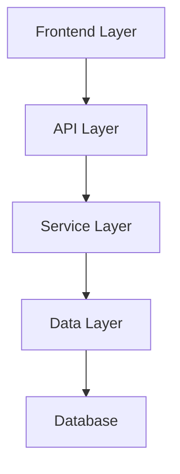
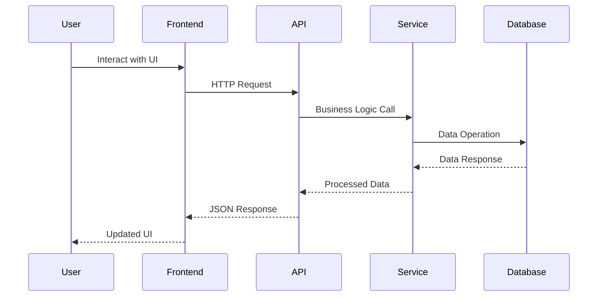
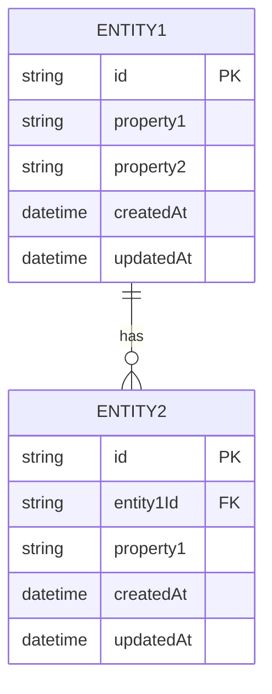
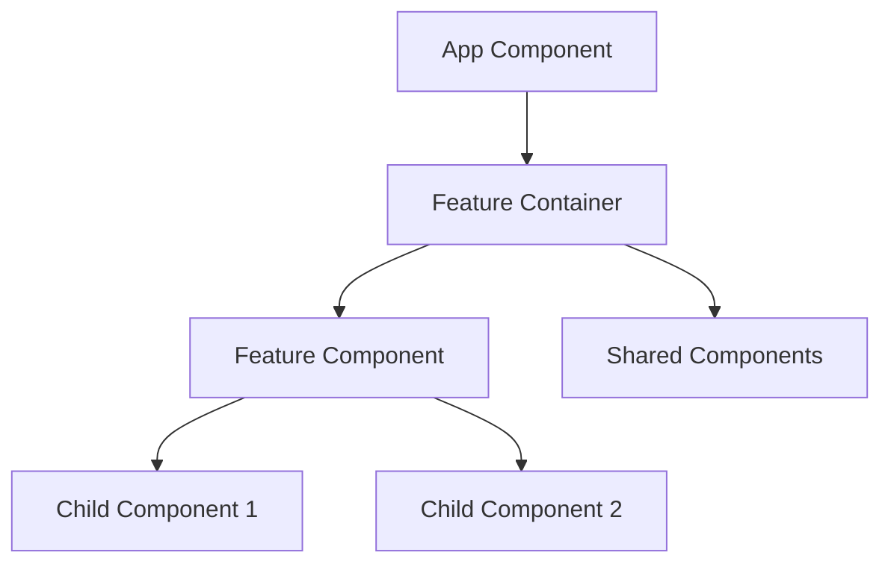
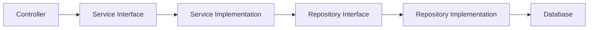

# Technical Design

## Design Overview

[High-level description of the technical approach and architecture decisions]

## Architecture Alignment

### Technology Stack Compliance
[How the design follows patterns established in tech.md]

### Project Structure Compliance  
[How the design respects conventions defined in structure.md]

## System Architecture

### High-Level Architecture



### Component Interaction



## Data Design

### Data Models

#### Core Entity: [EntityName]

```typescript
interface EntityName {
  id: string;
  [property]: [type];
  [property]: [type];
  createdAt: Date;
  updatedAt: Date;
}
```

#### Supporting Entity: [SupportingEntityName]

```typescript
interface SupportingEntityName {
  id: string;
  [property]: [type];
  [relationship]: EntityName;
  createdAt: Date;
  updatedAt: Date;
}
```

### Database Schema



### Data Validation Rules

1. **Entity1 Validation**
   - `property1`: [validation rules]
   - `property2`: [validation rules]

2. **Entity2 Validation**
   - `property1`: [validation rules]
   - `entity1Id`: Must reference valid Entity1

## API Design

### Endpoint Structure

#### RESTful API Endpoints

| Method | Endpoint | Purpose | Request Body | Response |
|--------|----------|---------|--------------|----------|
| GET | `/api/entities` | List all entities | - | `Entity[]` |
| GET | `/api/entities/:id` | Get specific entity | - | `Entity` |
| POST | `/api/entities` | Create new entity | `CreateEntityDto` | `Entity` |
| PUT | `/api/entities/:id` | Update entity | `UpdateEntityDto` | `Entity` |
| DELETE | `/api/entities/:id` | Delete entity | - | `DeleteResult` |

#### Request/Response DTOs

```typescript
interface CreateEntityDto {
  property1: string;
  property2: string;
}

interface UpdateEntityDto {
  property1?: string;
  property2?: string;
}

interface ApiResponse<T> {
  data: T;
  message: string;
  success: boolean;
  timestamp: Date;
}
```

### Authentication & Authorization

#### Authentication Flow
- [Authentication mechanism description]
- [Token handling and validation]

#### Authorization Rules
- **Role-based access**: [role definitions and permissions]
- **Resource-level permissions**: [entity-specific access rules]

## Frontend Design

### Component Architecture



### State Management

#### State Structure
```typescript
interface FeatureState {
  entities: Entity[];
  selectedEntity: Entity | null;
  loading: boolean;
  error: string | null;
  filters: FilterState;
}
```

#### State Management Pattern
- **State management library**: [Redux/Zustand/Context/etc.]
- **Actions and reducers**: [description of state updates]
- **Side effects**: [async operations and data fetching]

### UI/UX Design Patterns

#### Component Patterns
- **Container/Presentational**: [usage in the feature]
- **Hooks pattern**: [custom hooks for feature logic]
- **Error boundaries**: [error handling in components]

#### User Interface Design
- **Layout structure**: [grid/flexbox patterns]
- **Responsive design**: [mobile-first/desktop considerations]
- **Accessibility**: [WCAG compliance and screen reader support]

## Service Layer Design

### Service Architecture



#### Service Interfaces

```typescript
interface IEntityService {
  findAll(filters?: FilterDto): Promise<Entity[]>;
  findById(id: string): Promise<Entity>;
  create(dto: CreateEntityDto): Promise<Entity>;
  update(id: string, dto: UpdateEntityDto): Promise<Entity>;
  delete(id: string): Promise<void>;
}
```

#### Business Logic Design
1. **Entity Creation**
   - Validation logic
   - Business rule enforcement
   - Side effect handling

2. **Entity Updates**
   - Optimistic locking
   - Change tracking
   - Cascade operations

### Repository Layer Design

```typescript
interface IEntityRepository {
  findAll(options?: FindOptions): Promise<Entity[]>;
  findById(id: string): Promise<Entity | null>;
  create(entity: Entity): Promise<Entity>;
  update(id: string, updates: Partial<Entity>): Promise<Entity>;
  delete(id: string): Promise<void>;
}
```

## Integration Design

### Internal System Integrations

#### Service-to-Service Communication
- **Authentication service**: [how the feature integrates with auth]
- **Notification service**: [event triggers and notifications]
- **Audit service**: [activity logging and tracking]

#### Shared Resources
- **Utility functions**: [reusable code and helpers]
- **Configuration**: [environment and feature toggles]
- **Caching**: [cache strategies and invalidation]

### External System Integrations

#### Third-Party APIs
- **[Service Name]**: [purpose and integration details]
- **[Service Name]**: [purpose and integration details]

#### Event Handling
- **Event publishing**: [events published by this feature]
- **Event consumption**: [events this feature responds to]

## Security Design

### Authentication & Authorization
- **JWT token validation**: [token structure and verification]
- **Role-based permissions**: [permission matrix]
- **API security**: [rate limiting, input validation]

### Data Protection
- **Input validation**: [sanitization and validation rules]
- **SQL injection prevention**: [parameterized queries]
- **XSS protection**: [output encoding and CSP]

### Audit & Monitoring
- **Activity logging**: [what actions are logged]
- **Security monitoring**: [suspicious activity detection]
- **Data privacy**: [PII handling and protection]

## Performance Design

### Optimization Strategy
- **Database optimization**: [indexing strategy]
- **Caching strategy**: [cache layers and invalidation]
- **Query optimization**: [N+1 problem prevention]

### Scalability Considerations
- **Horizontal scaling**: [stateless design principles]
- **Load balancing**: [distribution strategy]
- **Resource management**: [connection pooling, memory usage]

### Performance Metrics
- **Response times**: [target SLA requirements]
- **Throughput**: [requests per second targets]
- **Resource usage**: [CPU, memory, database load]

## Error Handling Design

### Error Classification
1. **Validation Errors**: [client-side input errors]
2. **Business Logic Errors**: [domain rule violations]
3. **System Errors**: [infrastructure and service failures]

### Error Response Format
```typescript
interface ErrorResponse {
  error: {
    code: string;
    message: string;
    details?: any;
    timestamp: Date;
  };
  success: false;
}
```

### Error Recovery
- **Retry mechanisms**: [automatic retry for transient failures]
- **Circuit breakers**: [preventing cascade failures]
- **Fallback strategies**: [graceful degradation]

## Testing Strategy

### Unit Testing
- **Service layer tests**: [business logic validation]
- **Repository tests**: [data layer validation]
- **Component tests**: [UI behavior validation]

### Integration Testing
- **API endpoint tests**: [request/response validation]
- **Database integration**: [data persistence validation]
- **External service mocking**: [third-party API simulation]

### End-to-End Testing
- **User workflow tests**: [complete feature scenarios]
- **Cross-browser testing**: [compatibility validation]
- **Performance testing**: [load and stress testing]

## Deployment & Configuration

### Environment Configuration
- **Development**: [local development setup]
- **Staging**: [pre-production configuration]
- **Production**: [production-specific settings]

### Feature Flags
- **Rollout strategy**: [gradual feature enablement]
- **Toggle configuration**: [runtime feature control]
- **Monitoring**: [feature usage tracking]

### Migration Strategy
- **Database migrations**: [schema change management]
- **Data migrations**: [existing data transformation]
- **Rollback procedures**: [failure recovery plans]

## Future Considerations

### Extensibility Points
- **Plugin architecture**: [extension mechanisms]
- **Configuration flexibility**: [customization options]
- **API versioning**: [backward compatibility strategy]

### Performance Optimization
- **Advanced caching**: [Redis, CDN integration]
- **Database sharding**: [horizontal scaling strategy]
- **Microservice decomposition**: [service boundaries]

### Technology Evolution
- **Framework upgrades**: [migration planning]
- **New technology integration**: [evaluation criteria]
- **Technical debt management**: [refactoring priorities]

## Risk Assessment

### Technical Risks
1. **[Risk Category]**: [risk description and mitigation]
2. **[Risk Category]**: [risk description and mitigation]

### Business Risks
1. **[Risk Category]**: [risk description and mitigation]
2. **[Risk Category]**: [risk description and mitigation]

### Security Risks
1. **[Risk Category]**: [risk description and mitigation]
2. **[Risk Category]**: [risk description and mitigation]

## Decision Log

### Architectural Decisions
1. **[Decision Topic]**: [decision made and rationale]
2. **[Decision Topic]**: [decision made and rationale]

### Technology Choices
1. **[Technology Category]**: [choice made and justification]
2. **[Technology Category]**: [choice made and justification]

### Trade-offs
1. **[Trade-off Area]**: [options considered and decision rationale]
2. **[Trade-off Area]**: [options considered and decision rationale]