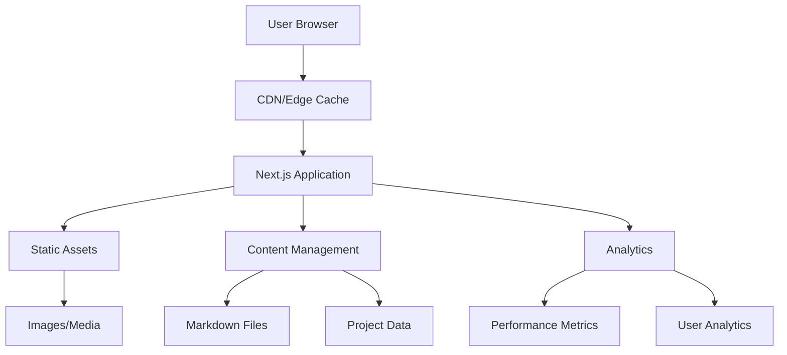
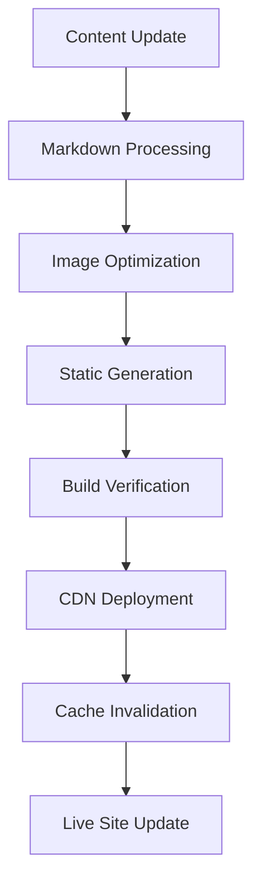
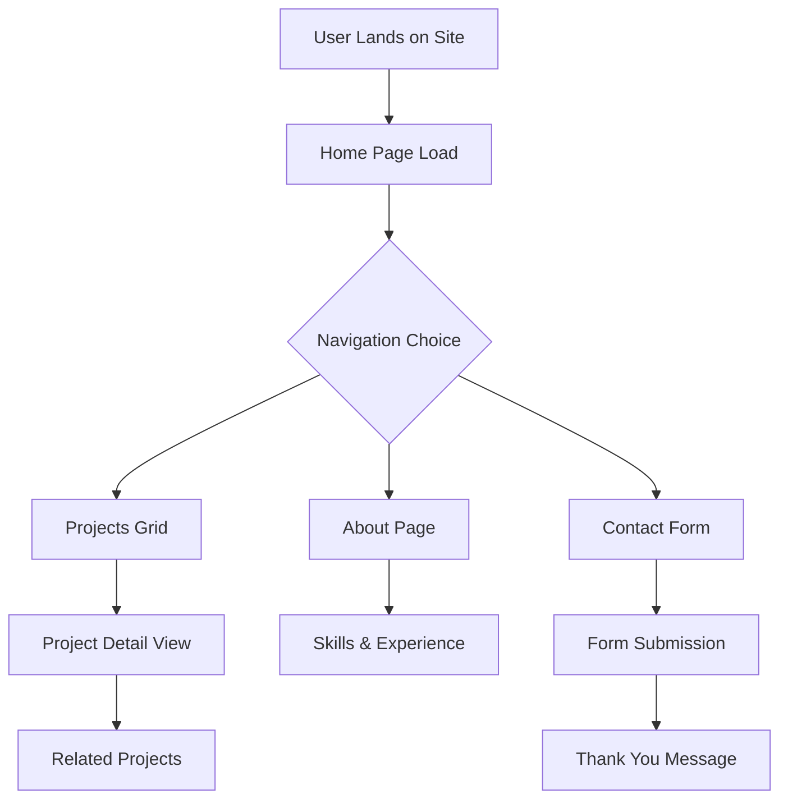

# Technical Design Document - Portfolio Website

## Overview

**Purpose**: This feature delivers a professional, high-performance personal portfolio website to showcase skills, projects, and experience for potential employers and clients.

**Users**: Portfolio owners and their visitors (recruiters, potential employers, clients, peers) will utilize this for personal branding, project showcasing, and professional networking.

### Goals

- Create a fast, SEO-optimized portfolio website with Core Web Vitals scores above 90
- Deliver a responsive, mobile-first experience across all devices
- Provide an intuitive content management system for easy updates
- Establish a professional online presence with modern design aesthetics

### Non-Goals

- E-commerce functionality or payment processing
- User authentication or user-generated content
- Real-time features or complex state management
- Multi-tenant or white-label solutions

## Architecture

### High-Level Architecture



### Technology Stack and Design Decisions

**Frontend Framework**:
- **Selection**: Next.js 14+ with App Router
- **Rationale**: Industry-leading React framework with built-in SSG, excellent SEO, and performance optimization features
- **Alternatives**: Astro (better performance but less flexible), Gatsby (outdated), vanilla React (lacks SSR/SSG)

**Styling & UI**:
- **Selection**: Tailwind CSS with shadcn/ui components
- **Rationale**: Utility-first CSS for rapid development, shadcn/ui provides accessible components with modern design system
- **Alternatives**: Styled Components (runtime overhead), CSS Modules (less flexible), pure CSS (maintenance burden)

**Content Management**:
- **Selection**: File-based content with Markdown + frontmatter
- **Rationale**: Developer-friendly, version-controlled, no external dependencies, excellent performance
- **Alternatives**: Headless CMS like Sanity (added complexity), JSON files (less readable), traditional CMS (overkill)

**Key Design Decisions**:

**Decision 1: Static Site Generation (SSG) Architecture**
- **Context**: Need maximum performance and SEO while minimizing hosting costs
- **Alternatives**: Server-Side Rendering (SSR), Client-Side Rendering (CSR), Incremental Static Regeneration (ISR)
- **Selected Approach**: Full static generation with build-time content processing
- **Rationale**: Portfolio content changes infrequently, static sites achieve best performance and can be hosted on CDN
- **Trade-offs**: Gain superior performance and hosting flexibility vs. sacrifice real-time content updates

**Decision 2: Component-First Architecture with Design System**
- **Context**: Need maintainable, consistent UI across all pages with room for customization
- **Alternatives**: Utility-only classes, pre-built theme, custom CSS architecture
- **Selected Approach**: shadcn/ui components with Tailwind CSS and custom design tokens
- **Rationale**: Provides accessibility, consistency, and customizability while maintaining performance
- **Trade-offs**: Gain component reusability and design consistency vs. some initial setup complexity

**Decision 3: File-Based Content Management**
- **Context**: Content updates should be trackable, reviewable, and not require external services
- **Alternatives**: Headless CMS (Sanity, Contentful), Database-driven, Hardcoded content
- **Selected Approach**: Markdown files with structured frontmatter in Git repository
- **Rationale**: Version control integration, no external dependencies, excellent developer experience
- **Trade-offs**: Gain simplicity and control vs. sacrifice non-technical user content editing

## System Flows

### Content Publishing Flow



### User Journey Flow



## Components and Interfaces

### Presentation Layer

#### Layout Components

**Responsibility & Boundaries**

- **Primary Responsibility**: Provide consistent page structure, navigation, and responsive layout containers
- **Domain Boundary**: UI presentation and user experience
- **Data Ownership**: Layout state, navigation state, responsive breakpoints

**Dependencies**

- **Inbound**: All page components depend on layout components
- **Outbound**: Theme provider, analytics components
- **External**: None

**Contract Definition**

```typescript
interface LayoutProps {
  children: React.ReactNode;
  title?: string;
  description?: string;
  className?: string;
}

interface NavigationItem {
  label: string;
  href: string;
  icon?: React.ComponentType;
  external?: boolean;
}

interface HeaderProps {
  navigation: NavigationItem[];
  currentPath: string;
  theme: 'light' | 'dark';
}

interface FooterProps {
  socialLinks: SocialLink[];
  contactEmail: string;
  copyrightYear: number;
}
```

#### Content Components

**Responsibility & Boundaries**

- **Primary Responsibility**: Display and format content (projects, about info, skills) with interactive elements
- **Domain Boundary**: Content presentation and user interaction
- **Data Ownership**: Component-level display state, interaction states

**Dependencies**

- **Inbound**: Page components pass content data to these components  
- **Outbound**: Analytics components for interaction tracking
- **External**: None (all content is static)

**Contract Definition**

```typescript
interface ProjectCardProps {
  project: Project;
  variant?: 'grid' | 'featured' | 'minimal';
  showDescription?: boolean;
  priority?: boolean; // For image loading optimization
}

interface SkillsSectionProps {
  skills: SkillCategory[];
  layout?: 'grid' | 'list' | 'tags';
  showProficiency?: boolean;
}

interface ContactFormProps {
  onSubmit: (data: ContactFormData) => Promise<void>;
  disabled?: boolean;
  className?: string;
}

interface ContactFormData {
  name: string;
  email: string;
  subject: string;
  message: string;
}
```

### Data Layer

#### Content Management

**Responsibility & Boundaries**

- **Primary Responsibility**: Parse, validate, and provide structured access to markdown content and project data
- **Domain Boundary**: Content processing and data transformation
- **Data Ownership**: All site content, project metadata, and static assets

**Dependencies**

- **Inbound**: Build system and page components request content data
- **Outbound**: File system, image optimization services
- **External**: None

**Contract Definition**

```typescript
interface ContentManager {
  getProjects(): Promise<Project[]>;
  getProject(slug: string): Promise<Project | null>;
  getAboutContent(): Promise<AboutContent>;
  getSkills(): Promise<SkillCategory[]>;
  validateContent(): Promise<ValidationResult>;
}

interface Project {
  slug: string;
  title: string;
  description: string;
  longDescription?: string;
  technologies: string[];
  liveUrl?: string;
  repoUrl?: string;
  images: ProjectImage[];
  featured: boolean;
  publishedAt: Date;
  status: 'completed' | 'in-progress' | 'archived';
}

interface ProjectImage {
  src: string;
  alt: string;
  width: number;
  height: number;
  priority?: boolean;
}
```

#### Analytics Integration

**Responsibility & Boundaries**

- **Primary Responsibility**: Track user interactions, performance metrics, and conversion events
- **Domain Boundary**: Analytics and performance monitoring
- **Data Ownership**: Analytics events, performance metrics

**External Dependencies Investigation**:

**Google Analytics 4**: 
- Latest version provides enhanced privacy controls and GA4 Universal Analytics replacement
- Supports custom events, conversion tracking, and enhanced ecommerce
- Free tier includes up to 10M events per month
- GDPR/CCPA compliant with proper configuration
- Requires Google tag integration and measurement ID setup

**Vercel Analytics** (if using Vercel deployment):
- Native integration with Next.js applications
- Provides Core Web Vitals monitoring and real user monitoring
- Privacy-friendly without cookies
- Includes both free tier (up to 100k requests) and pro tier options

**Contract Definition**

```typescript
interface AnalyticsService {
  trackPageView(path: string): void;
  trackEvent(event: AnalyticsEvent): void;
  trackFormSubmission(formType: string): void;
  trackProjectView(projectSlug: string): void;
}

interface AnalyticsEvent {
  action: string;
  category: string;
  label?: string;
  value?: number;
  customDimensions?: Record<string, string>;
}
```

## Data Models

### Content Domain Model

**Core Entities**:

- **Project**: Represents individual work samples with metadata, descriptions, and media assets
- **Skill Category**: Groups related technical and soft skills with optional proficiency indicators  
- **About Content**: Personal information, professional summary, and career timeline
- **Contact Information**: Communication preferences and social media links

**Business Rules & Invariants**:

- Projects must have unique slugs for URL generation
- Featured projects limited to maximum of 6 for performance
- All images must include alt text for accessibility
- Contact form submissions require valid email format

### Physical Data Model

**File System Structure**:

```
content/
├── projects/
│   ├── project-1.md
│   ├── project-2.md
│   └── images/
│       ├── project-1/
│       └── project-2/
├── about.md
├── skills.md
└── contact.md

public/
├── images/
│   ├── hero/
│   ├── projects/
│   └── icons/
└── assets/
    ├── resume.pdf
    └── documents/
```

**Markdown Frontmatter Schema**:

```yaml
# Project Frontmatter
---
title: "Project Name"
description: "Brief project description"
technologies: ["React", "TypeScript", "Tailwind"]
liveUrl: "https://example.com"
repoUrl: "https://github.com/username/repo"
featured: true
publishedAt: "2025-01-15"
status: "completed"
images:
  - src: "/images/projects/project-1/hero.jpg"
    alt: "Project screenshot"
    priority: true
---
```

### Data Processing Pipeline

**Content Validation**:

- Schema validation for all markdown frontmatter
- Image asset verification and optimization
- Link validation for external URLs
- Accessibility audit for alt text completeness

**Performance Optimization**:

- Image optimization with next/image automatic formats (WebP, AVIF)
- Content preloading for critical above-the-fold resources
- Bundle analysis and code splitting optimization

## Error Handling

### Error Strategy

**Graceful Degradation**: Portfolio sites must remain functional even when individual components fail. Implement fallback content, skeleton loading states, and progressive enhancement patterns.

**Build-Time Validation**: Comprehensive content validation during static generation prevents runtime errors and ensures content quality.

**Client-Side Resilience**: Robust error boundaries and retry mechanisms for dynamic features like contact forms and analytics.

### Error Categories and Responses

**Content Errors**: Missing project data → display placeholder card with "Content coming soon"; Invalid image paths → fallback to default project image; Malformed frontmatter → skip invalid entries with build warning

**Network Errors**: Contact form submission failure → show retry option with offline indicator; External link verification → graceful degradation with warning icon; Analytics tracking failure → silent failure without user impact

**Performance Errors**: Slow image loading → progressive loading with blur placeholders; JavaScript bundle failure → ensure core content remains accessible; Third-party service outage → disable enhanced features temporarily

### Monitoring

**Build-Time Monitoring**: Content validation reports, broken link detection, image optimization metrics
**Runtime Monitoring**: Core Web Vitals tracking, form submission success rates, user journey completion rates
**Error Tracking**: Client-side error boundary reports, failed form submissions, performance threshold breaches

## Testing Strategy

### Unit Tests

- Content parsing and validation functions
- Utility functions for date formatting and text processing  
- Component prop validation and error states
- Image optimization and responsive behavior
- Accessibility helpers and screen reader support

### Integration Tests

- Markdown content to component rendering pipeline
- Contact form submission workflow with validation
- Navigation state management across route changes
- SEO metadata generation from content files
- Image loading and optimization across different screen sizes

### E2E Tests

- Complete user journeys from landing to project detail views
- Contact form submission with success/error scenarios
- Mobile responsive behavior across breakpoints
- Page loading performance and Core Web Vitals
- Cross-browser compatibility testing

### Performance Testing

- Lighthouse CI integration for automated performance audits
- Bundle size monitoring and optimization verification
- Image loading performance across network conditions
- Time to first meaningful paint optimization validation

## Security Considerations

### Content Security Policy

- Strict CSP headers to prevent XSS attacks
- Allowlist for trusted external resources (fonts, analytics)
- Image source restrictions to prevent hotlinking abuse
- Form submission CSRF protection

### Privacy & Compliance

- GDPR-compliant analytics configuration with user consent
- Privacy-focused analytics options (Plausible, Fathom alternatives)
- Contact form data handling with proper retention policies
- Clear privacy policy for data collection practices

### Static Site Security

- Build environment security for content pipeline
- Asset optimization without exposing sensitive build information
- Secure hosting configuration with HTTPS enforcement
- Regular dependency updates and security scanning

## Performance & Scalability

### Target Metrics

- **Lighthouse Performance Score**: >95
- **Core Web Vitals**: LCP <1.2s, FID <100ms, CLS <0.1
- **Time to Interactive**: <2s on 3G networks
- **Bundle Size**: <150KB gzipped initial load

### Optimization Strategies

**Static Generation Optimizations**:
- Pre-generated HTML for all routes eliminates server response time
- Automatic code splitting reduces initial bundle size
- Image optimization with next/image for responsive delivery
- Font optimization with next/font for reduced layout shift

**Caching Strategy**:
- CDN edge caching for static assets with long cache headers
- Service worker implementation for offline content access
- Browser caching optimization for repeat visitors
- Dynamic import caching for route-based code splitting

**Content Delivery Optimization**:
- Critical CSS inlining for above-the-fold content
- Resource hints (preload, prefetch) for anticipated navigation
- Progressive image loading with blur placeholders
- Lazy loading for below-the-fold content and images